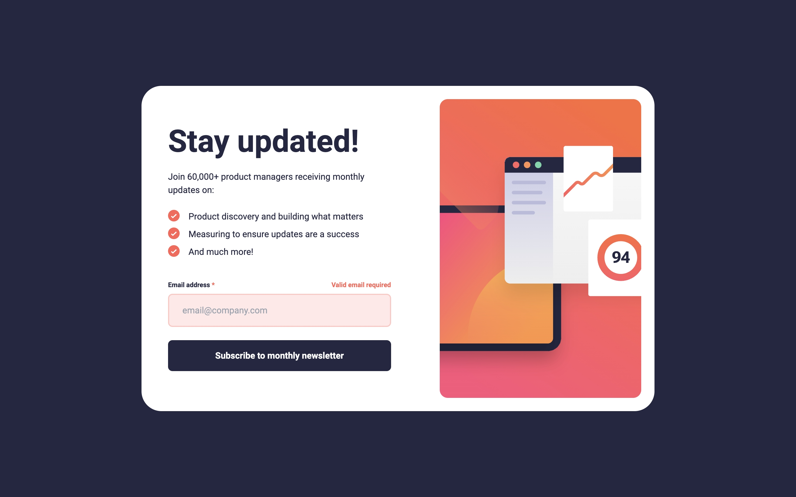
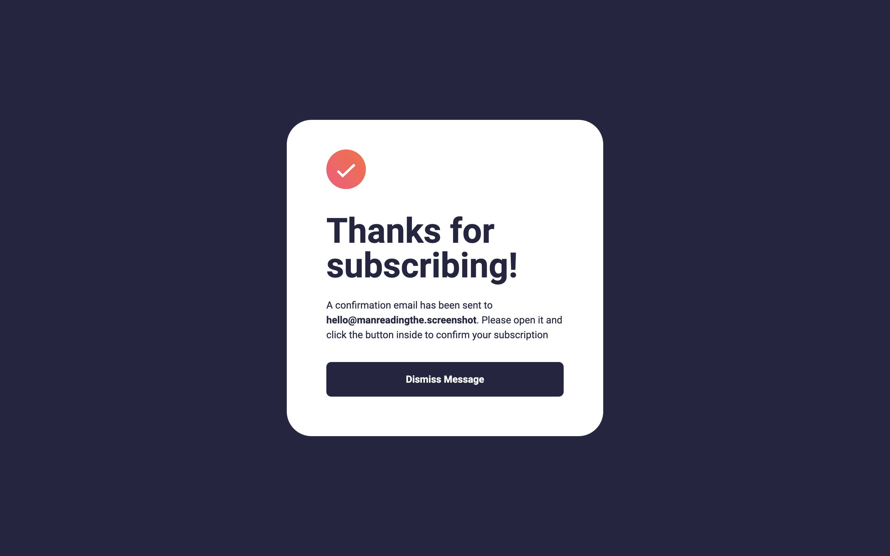
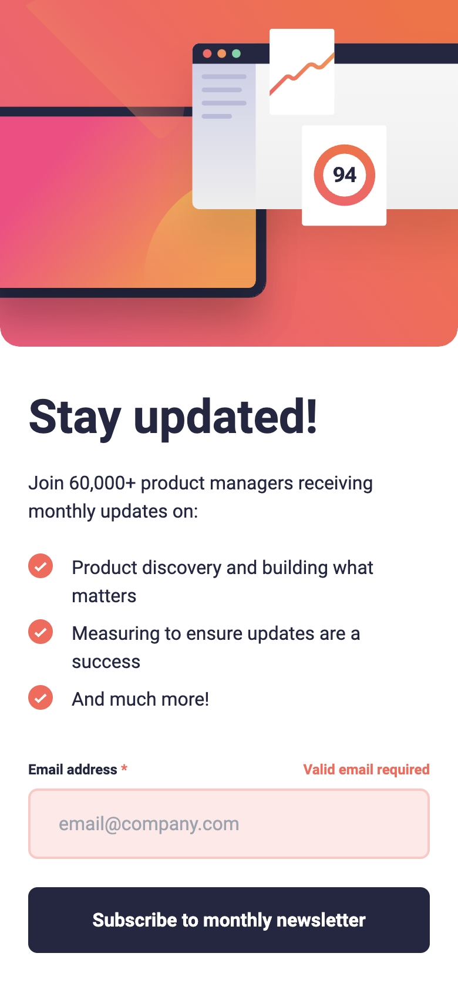
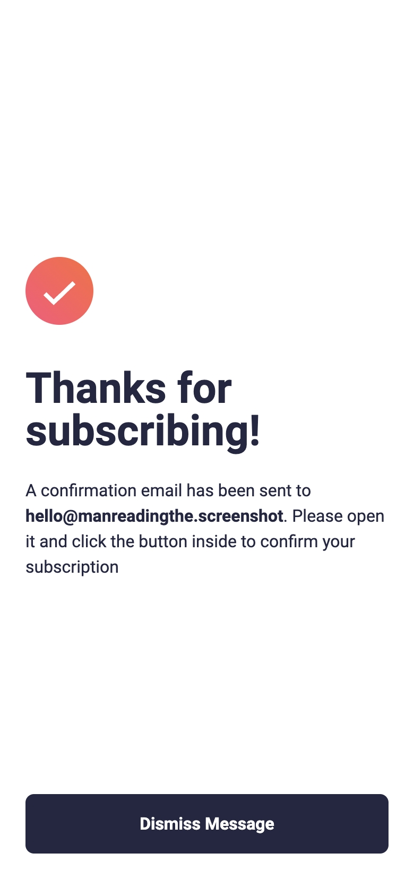

# Frontend Mentor - Newsletter sign-up form with success message solution

This is a solution to the [Newsletter sign-up form with success message challenge on Frontend Mentor](https://www.frontendmentor.io/challenges/newsletter-signup-form-with-success-message-3FC1AZbNrv). Frontend Mentor challenges help you improve your coding skills by building realistic projects.

     

## Table of contents

- [Frontend Mentor - Newsletter sign-up form with success message solution](#frontend-mentor---newsletter-sign-up-form-with-success-message-solution)
  - [Table of contents](#table-of-contents)
  - [Overview](#overview)
    - [The challenge](#the-challenge)
    - [Screenshot](#screenshot)
    - [Links](#links)
  - [My process](#my-process)
    - [Built with](#built-with)
    - [What I learned](#what-i-learned)
    - [Continued development](#continued-development)
    - [Useful resources](#useful-resources)

## Overview

### The challenge

Users should be able to:

- Add their email and submit the form
- See a success message with their email after successfully submitting the form
- See form validation messages if:
  - The field is left empty
  - The email address is not formatted correctly
- View the optimal layout for the interface depending on their device's screen size
- See hover and focus states for all interactive elements on the page

### Screenshot

Desktop

Mobile

### Links

- [Live Site URL](https://newsletter-sign-up-form.frilly.dev)

## My process

### Built with

- [Tailwind CSS](https://tailwindcss.com/)
- [Vue](https://vuejs.org/)
- [Astro](https://astro.build/)

### What I learned

- Styling bullet points with `background-image` gives more control over styling with `list-style-type` and `list-style-position` or `::marker`.
- No way to have a `<picture>` equivalence for `<svg>` apparently, and default to using `img` tag for SVGs. Not as fast as using inline SVGs, but still great to use media queries with.

### Continued development

I took a bit too long with the responsive design. I need a lot of practice here.

### Useful resources

- [Styling list - MDN Docs](https://developer.mozilla.org/en-US/docs/Learn/CSS/Styling_text/Styling_lists) - Helped with styling `<ul>` and `<li>` elements.
- [Flexbox Order](https://developer.mozilla.org/en-US/docs/Web/CSS/CSS_flexible_box_layout/Ordering_flex_items) - Ordering flex items.
